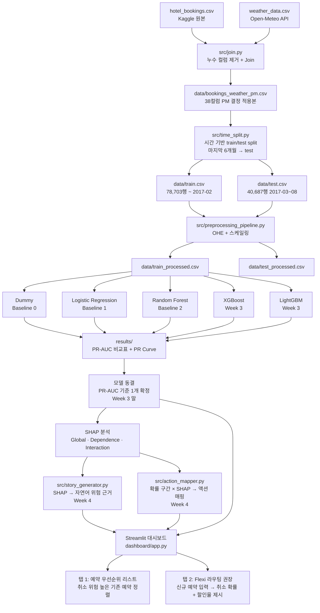

# 시스템 아키텍처

## 전체 파이프라인



## 폴더 구조

```
07_Hotel_DSS/
├── data/
│   ├── README.md                    # 데이터 출처 및 재현 안내
│   ├── bookings_weather_pm.csv      # PM 결정 적용본 (gitignore)
│   ├── train.csv                    # 시간 기반 split 학습셋 (gitignore)
│   ├── test.csv                     # 시간 기반 split 테스트셋 (gitignore)
│   ├── train_processed.csv          # 전처리 완료 (gitignore)
│   └── test_processed.csv           # 전처리 완료 (gitignore)
├── src/
│   ├── 01_columns_dictionary.py     # 컬럼 사전 작성
│   ├── 02_leakage_check.py          # 누수 컬럼 검토
│   ├── time_split.py                # 시간 기반 train/test 분리
│   ├── preprocessing_pipeline.py    # OHE + 스케일링 파이프라인
│   ├── dummy_classifier.py          # Dummy baseline
│   ├── story_generator.py           # SHAP → 자연어 해석 (Week 4)
│   └── action_mapper.py             # 확률 + 피처 → 권장 액션 (Week 4)
├── notebooks/
│   └── eda.ipynb                    # EDA
├── dashboard/
│   └── app.py                       # Streamlit 대시보드 (Week 4)
├── results/
│   ├── pr_curve_baseline.png        # PR Curve 시각화
│   └── baseline_results.md          # 모델별 PR-AUC / F1 비교표
├── docs/
│   ├── design_00_problem_definition.md
│   ├── design_01_columns_dictionary.md
│   ├── design_03_weather_data.md
│   ├── design_04_preprocessing_decisions.md
│   ├── design_05_system_architecture.md   # 이 문서
│   ├── design_06_flexi_system.md
│   ├── design_07_shap_guide.md
│   └── design_08_literature_review.md
├── presentations/
│   ├── cheatsheet_presentation.py
│   └── Hotel No-Show DSS v2.html
├── CLAUDE.md
├── SCHEDULE.md
├── requirements.txt
└── README.md
```

## 주차별 주요 산출물

| Phase | Week | 기간 | 핵심 산출물 | 담당 |
|-------|------|------|------------|------|
| 1 | Week 1 | 4/28~5/4 | 문제 정의, 누수 검토, 날씨 수집·Join, 시간 split, 1차 발표 | 전체 |
| 1 | **Week 2** | **5/5~5/11** | **전처리 파이프라인, Dummy·LR·RF Baseline, PR-AUC 비교** | 심재형(파이프라인+Dummy) / 김나리(LR) / 이고은(RF) |
| 1 | Week 3 | 5/12~5/18 | XGBoost + LightGBM → **모델 동결** | 이고은(XGBoost) / 김나리(LightGBM) / 심재형(비교) |
| 1 | Week 4 | 5/19~5/25 | SHAP 연동 + Streamlit 앱 (탭 1·2) → **MVP 배포** | 심재형(SHAP+Flexi) / 팀 스프린트 |
| — | 중간발표 | 5/27 | MVP 시연 | — |
| 2 | Week 5 | 5/28~6/2 | SHAP 기반 가정 검증 (날씨 윈도우, previous_cancellations, LIME 비교) | 전체 |
| 2 | Week 6 | 6/3~6/9 | 최종 피처셋 확정 + 앱 반영 + 발표 준비 | 전체 |
| — | 최종발표 | 6/10 | 최종 시연 | — |

## 앱 인터페이스 설계 (Week 4 목표)

| 탭 | 대상 | 입력 | 출력 |
|----|------|------|------|
| 탭 1: 예약 우선순위 | 기존 예약 리스트 | test.csv 또는 신규 배치 | 취소 위험 순위 정렬 + SHAP 근거 |
| 탭 2: Flexi 라우팅 | 신규 예약 1건 | 예약 정보 입력 폼 | 취소 확률 + Flexi 권장 여부 + 할인율 |

**할인율 공식 (탭 2):**
```
할인율 = 5% + (위험점수 − 0.5) × 26%    [5% ≤ 할인율 ≤ 18%]
```

**날씨 처리 (탭 2):** 도착일 날씨 = 호텔·월 기준 역사적 계절 평균값 자동 입력. UI에 "(계절 평균값)" 명시.
