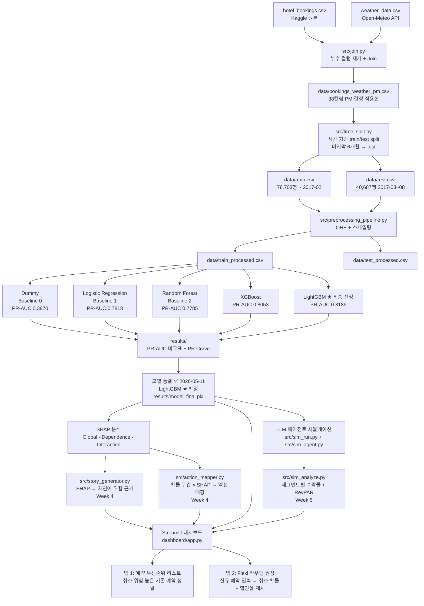

# 시스템 아키텍처

> 최종 업데이트: 2026-05-13 | 모델 동결: LightGBM ★ (PR-AUC 0.8189)

## 전체 파이프라인



## 폴더 구조

```
07_Hotel_DSS/
├── data/
│   ├── README.md                    # 데이터 출처 및 재현 안내
│   ├── bookings_weather_pm.csv      # PM 결정 적용본 (gitignore)
│   ├── train.csv                    # 시간 기반 split 학습셋 (gitignore)
│   ├── test.csv                     # 시간 기반 split 테스트셋 (gitignore)
│   ├── train_processed.csv          # 전처리 완료 (gitignore)
│   └── test_processed.csv           # 전처리 완료 (gitignore)
├── src/
│   ├── 01_columns_dictionary.py     # 컬럼 사전 작성
│   ├── 02_leakage_check.py          # 누수 컬럼 검토
│   ├── time_split.py                # 시간 기반 train/test 분리
│   ├── preprocessing_pipeline.py    # OHE + 스케일링 파이프라인
│   ├── dummy_classifier.py          # Dummy baseline
│   ├── lr_baseline.py               # LR baseline
│   ├── rf_baseline.py               # RF baseline
│   ├── run_baselines.py             # Dummy·LR·RF 일괄 실행
│   ├── run_all_models.py            # 5종 모델 전체 실행
│   ├── shap_analysis.py             # SHAP global·dependence·waterfall
│   ├── sim_agent.py                 # LLM 게스트 에이전트 (AgentSociety 3층 심리모델)
│   ├── sim_run.py                   # 시뮬레이션 오케스트레이터 (멀티스레드 배치)
│   ├── sim_hotel.py                 # 호텔 수익 계산 (RevPAR, walk_rate)
│   ├── sim_analyze.py               # 시뮬레이션 결과 분석 + 시각화
│   ├── sim_setup.sh                 # 학교 서버 셋업 스크립트
│   ├── story_generator.py           # SHAP → 자연어 해석 (Week 4)
│   └── action_mapper.py             # 확률 + 피처 → 권장 액션 (Week 4)
├── notebooks/
│   └── eda_master.ipynb             # EDA (채널·BQS·날씨·SHAP)
├── dashboard/
│   └── app.py                       # Streamlit 대시보드
├── results/
│   ├── pr_curve_baseline.png        # Dummy·LR·RF PR Curve
│   ├── pr_curve_all.png             # 5종 비교 PR Curve
│   ├── baseline_results.md          # 모델별 PR-AUC / F1 비교표
│   ├── model_final.pkl              # LightGBM 최종 모델
│   ├── shap_lgbm_bar.png            # SHAP bar (전체 피처 중요도)
│   ├── shap_lgbm_beeswarm.png       # SHAP beeswarm
│   ├── shap_waterfall.png           # SHAP waterfall (예시 예약)
│   ├── sim_responses.jsonl          # LLM 에이전트 반응 원본 (Week 5)
│   ├── sim_sweep_results.csv        # 임계값 스윕 결과 (Week 5)
│   └── sim_*.png                    # 시뮬레이션 시각화 3종 (Week 5)
├── docs/
│   ├── design_00_problem_definition.md
│   ├── design_01_columns_dictionary.md
│   ├── design_03_weather_data.md
│   ├── design_04_preprocessing_decisions.md
│   ├── design_05_system_architecture.md   # 이 문서
│   ├── design_06_flexi_system.md          # Flexi 시스템 + LLM 에이전트 설계
│   ├── design_07_shap_guide.md
│   ├── design_08_literature_review.md
│   ├── design_09_beyond_cancellation.md   # 채널·BQS·음식낭비 (Phase 2)
│   ├── design_10_sim_persona_design.md    # LLM 에이전트 페르소나 방법론
│   └── design_11_wireframe.md             # Streamlit UI 와이어프레임
├── meetings/
│   ├── week1_presentation.md        # 1차 발표 슬라이드 초안
│   ├── week2_eda_prev_cancel.md     # Week 2 previous_cancellations EDA
│   ├── week2_review.md              # Week 2 PM 리뷰
│   ├── week3_meeting.md             # Week 3 팀 회의 안건
│   ├── week3_plan.md                # Week 3 PM 상세 계획
│   └── week3_week4_workplan.md      # Week 3~4 업무표 + 발표 준비
├── presentations/
│   └── Hotel No-Show DSS v2.html
├── CLAUDE.md
├── requirements.txt
└── README.md
```

## 주차별 주요 산출물

| Phase | Week | 기간 | 핵심 산출물 | 상태 |
|-------|------|------|------------|------|
| 1 | Week 1 | 4/28~5/4 | 문제 정의, 누수 검토, 날씨 수집·Join, 시간 split, 1차 발표 | ✅ 완료 |
| 1 | Week 2 | 5/5~5/11 | 전처리 파이프라인, Dummy·LR·RF Baseline, PR-AUC 비교 | ✅ 완료 |
| 1 | Week 3 | 5/12~5/18 | XGBoost + **LightGBM ★ 동결** + SHAP + sim dry-run | ✅ 완료 |
| 1 | Week 4 | 5/19~5/25 | SHAP 연동 + Streamlit 앱 (탭 1·2) → **MVP 배포** | 진행중 |
| — | 중간발표 | 5/27 | MVP 시연 + LLM 시뮬레이션 예고 | — |
| 2 | Week 5 | 5/28~6/2 | **LLM 에이전트 시뮬레이션** (~13,355건, 학교 서버) + 결과 분석 | 예정 |
| 2 | Week 6 | 6/3~6/9 | 시뮬레이션 인사이트 + 앱 통합 + 발표 준비 | 예정 |
| — | 최종발표 | 6/10 | 최종 시연 + LLM 시뮬레이션 피날레 | — |

## 앱 인터페이스 설계

| 탭 | 대상 | 입력 | 출력 |
|----|------|------|------|
| 탭 1: 예약 우선순위 | 기존 예약 리스트 | test.csv 또는 신규 배치 | 취소 위험 순위 정렬 + SHAP 근거 |
| 탭 2: Flexi 라우팅 | 신규 예약 1건 | 예약 정보 입력 폼 | 취소 확률 + Flexi 권장 여부 + 할인율 |

**할인율 공식 (탭 2):**
```
할인율 = 5% + (위험점수 − 0.5) × 26%    [5% ≤ 할인율 ≤ 18%]
```

**날씨 처리 (탭 2):** 도착일 날씨 = 호텔·월 기준 역사적 계절 평균값 자동 입력. UI에 "(계절 평균값)" 명시.

## LLM 에이전트 시뮬레이션 구조 (Week 5)

```
테스트셋 40,687건
  ↓ cancel_prob ≥ 0.40 필터 (LightGBM 예측값)
고위험 풀 ~13,355건
  ↓ 전수 실행 (--all 모드)
LLM 게스트 에이전트 (Qwen2.5-14B, 학교 서버 A5000×2)
  ↓ AgentSociety 3층 심리모델 (Emotions × Needs × Cognition)
  ↓ 7개 SHAP-검증 피처 → 자연어 페르소나
  ↓ 4단계 추론 → ACCEPT_FLEXI / DECLINE_FLEXI / CANCEL
results/sim_responses.jsonl
  ↓ sim_analyze.py
세그먼트별 수락률 + 최적 임계값 + RevPAR 개선치
```

**실행 명령:**
```bash
# 학교 서버에서
bash src/sim_setup.sh
nohup bash start_vllm.sh > logs/vllm.log 2>&1 &
python src/sim_run.py --all --workers 16
python src/sim_analyze.py
```
