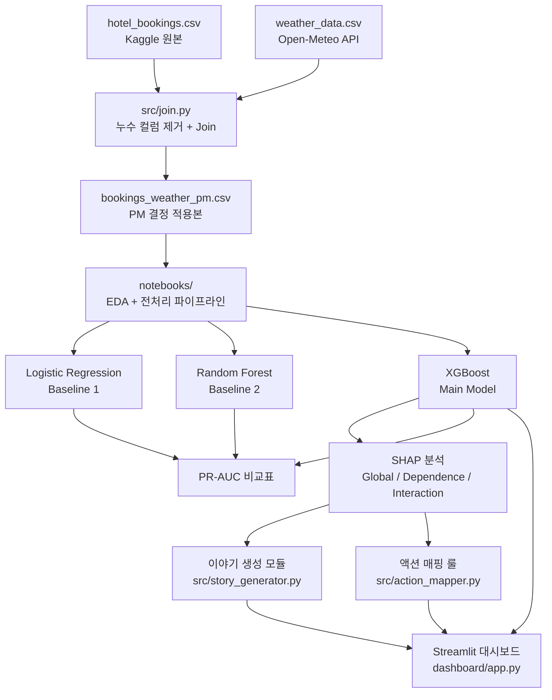

# 시스템 아키텍처

## 전체 파이프라인



## 폴더 구조

```
ml_project/
├── data/               # CSV 파일 (gitignore, README에 출처 안내)
├── notebooks/          # EDA, 전처리, 모델 학습 Jupyter 노트북
├── src/
│   ├── weather.py          # Open-Meteo 날씨 수집
│   ├── join.py             # 예약 + 날씨 Join
│   ├── story_generator.py  # SHAP → 자연어 해석 (Week 4)
│   └── action_mapper.py    # 확률 + 변수 → 권장 액션 (Week 4)
├── dashboard/
│   └── app.py              # Streamlit 대시보드 (Week 4)
├── docs/
│   ├── system_architecture.md   # 이 문서
│   ├── leakage_columns_review.md
│   └── presentation_outline.md
├── PROBLEM_DEFINITION.md
├── AI_USAGE_LOG.md
├── VALIDATION_LOG.md
├── requirements.txt
└── README.md
```

## 주차별 주요 산출물

| Week | 산출물 |
|------|--------|
| 1 | 데이터 수집·Join, 누수 컬럼 분류, 문제 정의 |
| 2 | EDA, 전처리 파이프라인, Baseline 모델 |
| 3 | XGBoost 튜닝, threshold 결정, 중간발표 |
| 4 | SHAP 분석 3종, 이야기 생성, 액션 매핑, 대시보드 |
| 5 | 최종 발표 준비, README 정리 |
