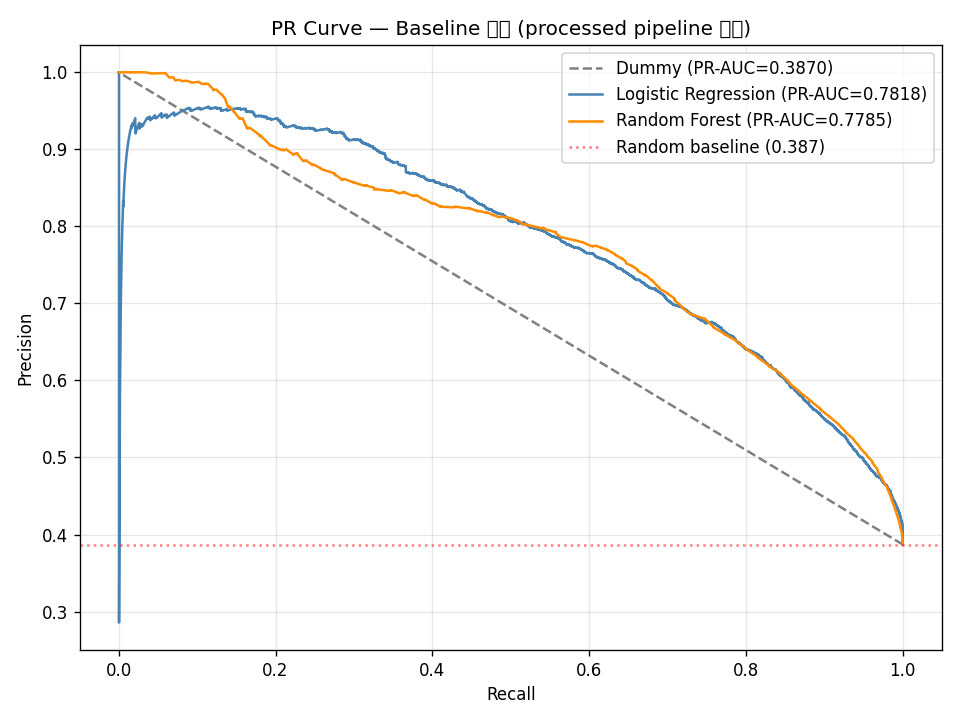

# Baseline 모델 결과 비교

테스트셋: 40,687행 (2017-01 ~ 2017-08) | 취소율 38.7%

| # | 모델 | PR-AUC | F1@0.5 | 비고 |
|---|------|--------|--------|------|
| 0 | Dummy (most_frequent) | **0.3870** | 0.0000 | 기준선. 이 이상이어야 의미 있음 |
| 1 | Logistic Regression | **0.7818** | 0.7073 | C=1, StandardScaler |
| 2 | Random Forest | **0.7785** | 0.6454 | n_estimators=100 |
| 3 | XGBoost | — | — | Week 3 이고은 |
| 4 | LightGBM | — | — | Week 3 김나리 |

## 해석 메모

- Dummy PR-AUC = 0.3870 ≈ 테스트셋 취소율. 예상된 수치 (상수 예측기의 이론적 PR-AUC = 양성 비율)
- F1@0.5 = 0.000 : most_frequent → 전부 "취소 없음"으로 예측하므로 양성 클래스 TP 없음
- **실질 기준선: PR-AUC > 0.40 이상부터 모델이 Dummy를 이김**
- LR·RF 모두 Dummy 대비 큰 폭 개선
- RF PR-AUC < LR, RF F1@0.5 < LR

## 파이프라인 기준

이 결과는 `src/preprocessing_pipeline.py` 출력 기준.
deposit_type DROP + country Top10+Other OHE 적용됨.

## PR Curve

## 미결 #2 해소

precipitation_sum vs precipitation_hours 상관: **0.824** (0.9 미만)
→ 현재 단계에서 제거 불필요. Phase 2에서 변수 중요도 확인 후 판단.
